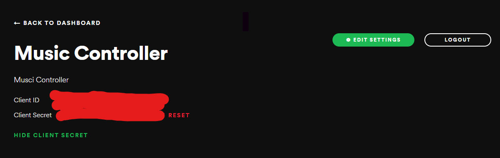
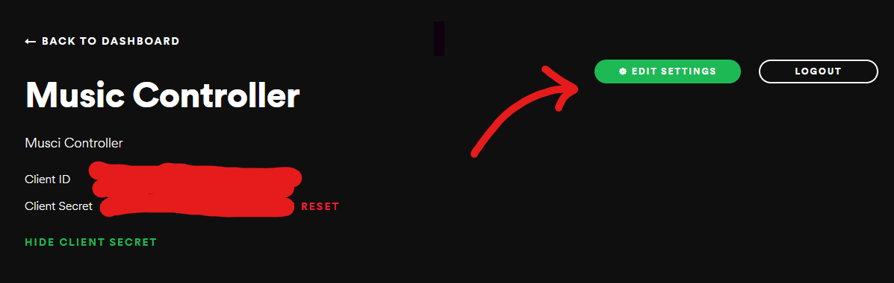
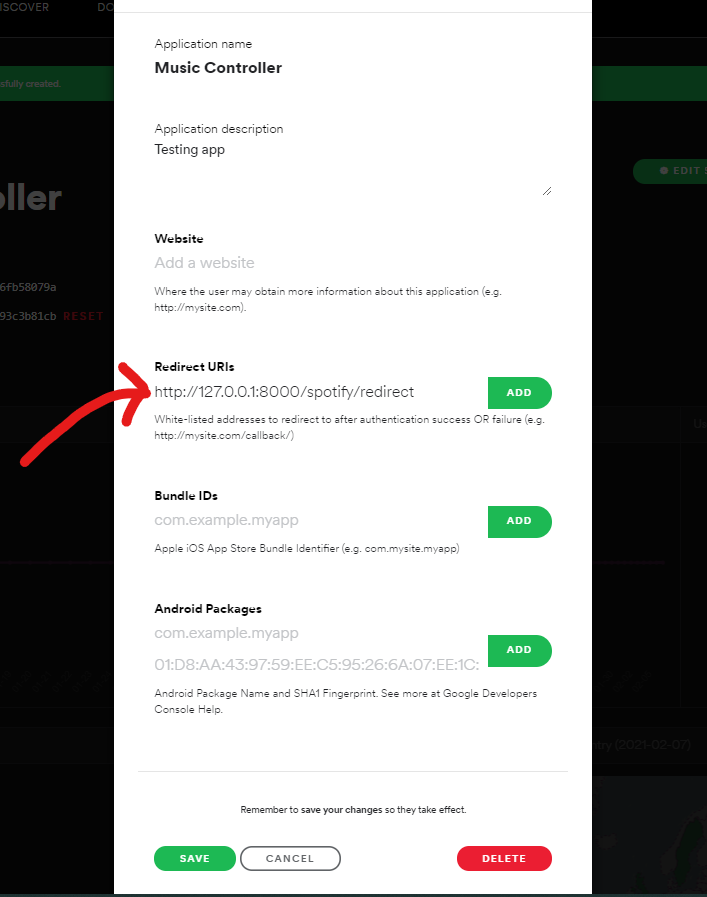
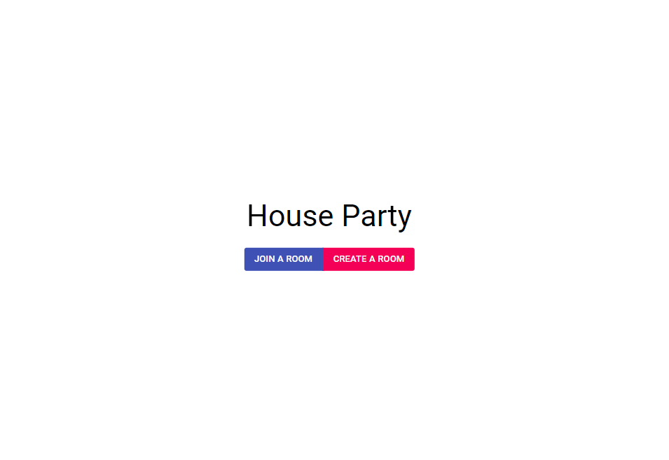
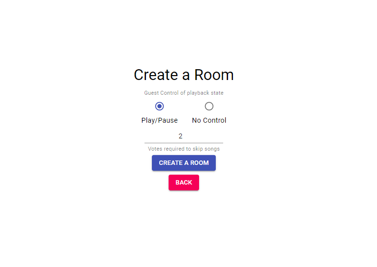
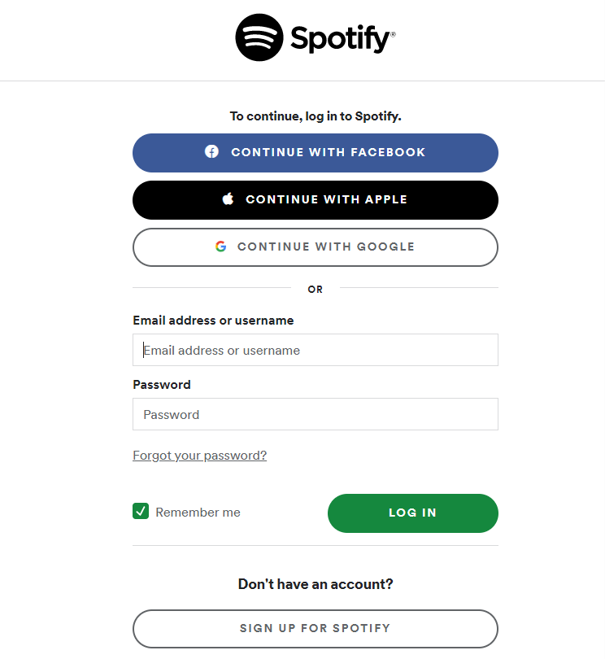
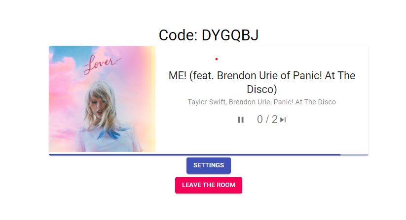
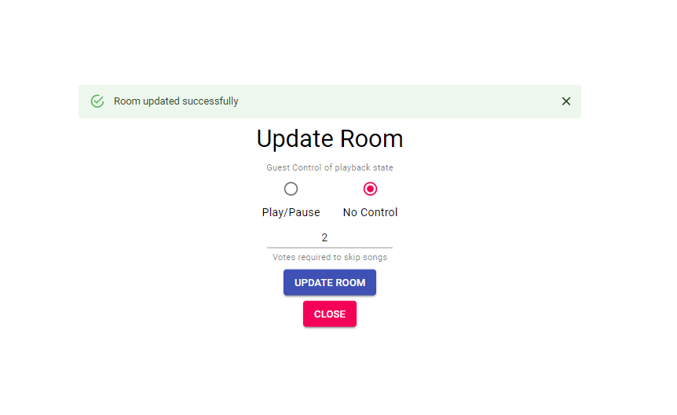
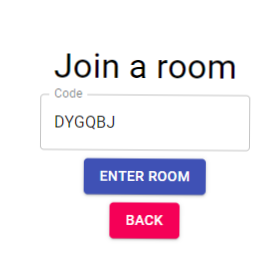
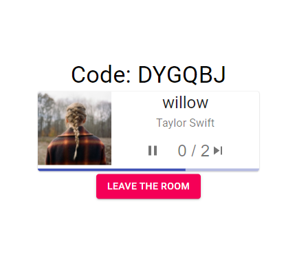

# Music Controller

An application that can help your team play the songs everyone want to listen to. People can even vote to skip a song based on the required number of votes.  
Use it for a friendly working environment or party
Tutorial resources: [here](https://www.youtube.com/watch?v=JD-age0BPVo&list=PLzMcBGfZo4-kCLWnGmK0jUBmGLaJxvi4j&index=1)
# Set up

Clone the project to your local machine

1. Python
2. Django and rest_framework
   ```
   pip install django djangorestframework
   ```
3. Node.js and npm
4. React components
   ```
   >>> cd frontend
   >>> npm install
   ```
5. Create user credentials in Spotify api website
   - Go to this website and logIn with your valid Spotify account: [here](https://developer.spotify.com/dashboard/)
   - Click on the app created, which will lead you to a page where you can view your app information
     
   - Then go to **spotify** folder and create credentials.py file, and enter the following informatino
   ```python
    REDIRECT_URI = "http://127.0.0.1:8000/spotify/redirect"  # do not change this line
    CLIENT_ID = "your_client_id"
    CLIENT_SECRET = "your_client_secret"
   ```
   - Then add the direct link in your app edit settings
     
   - Then add the redirect link. Click Add and then Save
     
6. Create the database file:
   ```
   >>> python .\manage.py migrate
   ```
7. Inside the **music_controller** folder, run the server: `python .\manage.py runserver` and go to the project link given in the terminal

# App walk through

1. App homepage
   
2. The host of the party can click on create room, which will lead to a page:
   

   - The radio buttons decide if the other members (excluding the host) of the room could pause the song or not
   - The number show how many votes (aka. the number of people agree) should be meet to skip the song

3. Click on _"Create A Room"_ and go through the authorization process of Spotify
   

4. Then use your spotify account and play a song. You will see the song's information shown in the room
   
5. The host can click on the Settings button to change the settings for the room. Example here we do not allow members to pause the song
   
6. For the other members, from the Homepage, you can choose to join the room by asking for the roomCode from the host. Example: DYGQBL
   
7. From members perspetive, you can vote to skip the song
   

# Applications:

1. Coffee store songs based on customer feedback
2. Party songs under control of the attendees
